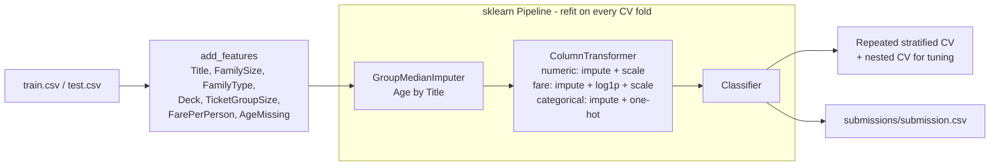

# Titanic survival prediction

[](https://github.com/nicholascomuni/kaggle-titanic/actions/workflows/ci.yml)
[](LICENSE)


A clean, end-to-end take on the Kaggle [Titanic](https://www.kaggle.com/competitions/titanic) competition: EDA,
feature engineering, a leak-free scikit-learn `Pipeline` + `ColumnTransformer`, cross-validated model comparison,
nested-CV tuning and a submission file. The focus is on sound validation practice rather than leaderboard tricks.

Everything lives in one notebook: [`titanic.ipynb`](titanic.ipynb).

## Results

Accuracy on the 891 training passengers, 5-fold stratified CV repeated 3 times (same splits for every model).
These numbers come from the committed notebook run.

| Model | CV accuracy | Train accuracy |
|---|---|---|
| Majority class ("everyone died") | 0.616 ± 0.002 | 0.616 |
| Rule: women survive | 0.787 ± 0.021 | - |
| Decision tree on sex, title, family size (first version of this project) | 0.822 ± 0.027 | 0.829 |
| Logistic regression | 0.827 ± 0.022 | 0.838 |
| SVM (RBF) | 0.827 ± 0.020 | 0.845 |
| Random forest | 0.827 ± 0.015 | 0.909 |
| **Gradient boosting** | **0.838 ± 0.017** | 0.913 |
| Gradient boosting, grid-searched (nested 5-fold CV) | 0.828 ± 0.016 | - |

Takeaways:

- Sex, title and family size carry most of the signal; the extra features add a small but consistent 1-2 points.
- The grid search's best inner-CV score (0.850) is optimistic; nested CV shows tuning gives no measurable gain here.
- Remaining errors concentrate in third-class women and first-class men, the groups whose survival is closest to
  a coin flip (~35% error rate each vs. 4-11% elsewhere).
- The submission file has not been scored on the Kaggle leaderboard as part of this run, so no leaderboard score is
  reported.

## Approach



- **Feature engineering** (deterministic, row-level): title parsed from the name and grouped (`Mr`, `Mrs`, `Miss`,
  `Master`, `Rare`), family size and a solo/small/large bucket, deck letter from the cabin, number of passengers
  sharing a ticket, fare per person, and a missing-age flag.
- **Preprocessing inside the pipeline**: a small custom transformer imputes `Age` with the median of the passenger's
  title, learned on the training fold only; fare, embarkation port and the rest are imputed, scaled and one-hot
  encoded by a `ColumnTransformer`, so nothing leaks from validation folds.
- **Validation**: repeated stratified K-fold for the model comparison, with two no-model references (majority class,
  "women survive"). Grid search is wrapped in an outer CV loop (nested CV) to get an unbiased estimate of the tuned
  model.

## Project structure

```
.
├── titanic.ipynb          # the full analysis, executed top to bottom
├── requirements.txt       # pinned runtime dependencies
├── requirements-dev.txt   # + ruff
├── ruff.toml
├── data/                  # train.csv, test.csv (not committed)
└── submissions/           # generated submission.csv (not committed)
```

## How to run

Requires Python 3.11+ and a [Kaggle API token](https://www.kaggle.com/docs/api) (you also need to accept the
competition rules on Kaggle once).

```bash
python -m venv .venv && source .venv/bin/activate
pip install -r requirements.txt kaggle

kaggle competitions download -c titanic -p data
unzip -o data/titanic.zip -d data

jupyter nbconvert --to notebook --execute --inplace titanic.ipynb   # ~3 minutes on 2 cores
```

To explore interactively, `pip install jupyterlab` and run `jupyter lab`. If `data/test.csv` is missing the notebook
still runs and simply skips the submission step. The generated file is `submissions/submission.csv`.

Linting (also run in CI):

```bash
pip install -r requirements-dev.txt
ruff check . && ruff format --check .
```

## Next steps

- Group-survival features (did other members of the same family / ticket survive?), computed inside each CV fold to
  avoid target leakage - aimed at the third-class women / first-class men errors.
- Permutation importance on held-out folds and pruning of features that do not help.
- A soft-voting ensemble of logistic regression, SVM and gradient boosting.

## License

[MIT](LICENSE)
